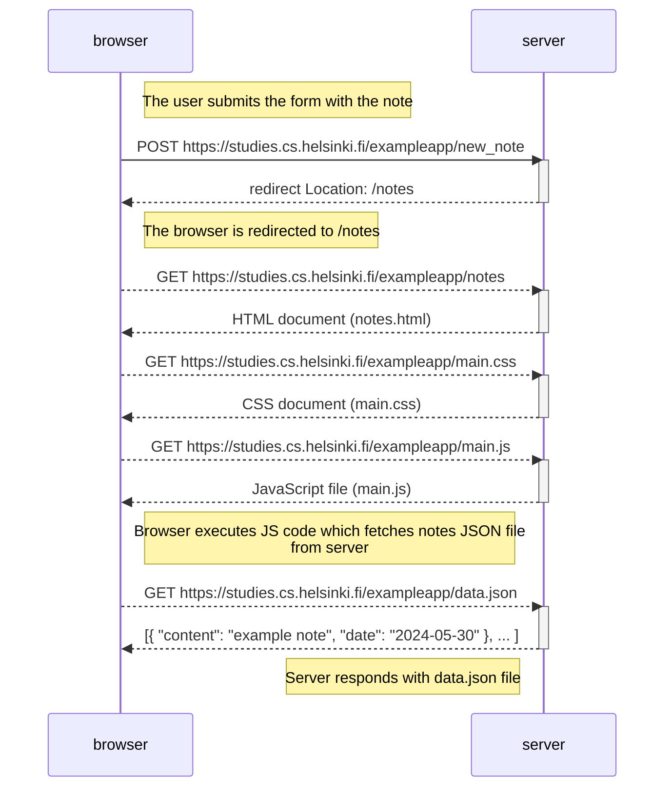

```mermaid
sequenceDiagram
    participant browser
    participant server

    Note right of browser: The user submits the form with the note

    browser->>server: POST https://studies.cs.helsinki.fi/exampleapp/new_note
    activate server

    server-->>browser: redirect Location: /notes
    deactivate server
    Note right of browser: The browser is redirected to /notes

    browser-->>server: GET https://studies.cs.helsinki.fi/exampleapp/notes
    
    activate server
    server-->>browser: HTML document (notes.html)
    deactivate server

    browser-->>server: GET https://studies.cs.helsinki.fi/exampleapp/main.css

    activate server
    server-->>browser: CSS document (main.css)
    deactivate server

    browser-->>server: GET https://studies.cs.helsinki.fi/exampleapp/main.js
    activate server
    server-->>browser: JavaScript file (main.js)
    deactivate server

    Note right of browser: Browser executes JS code which fetches notes JSON file <br/> from server 

    browser-->>server: GET https://studies.cs.helsinki.fi/exampleapp/data.json
    activate server
    server-->>browser: [{ "content": "example note", "date": "2024-05-30" }, ... ]
    deactivate server
    Note left of server: Server responds with data.json file
```
