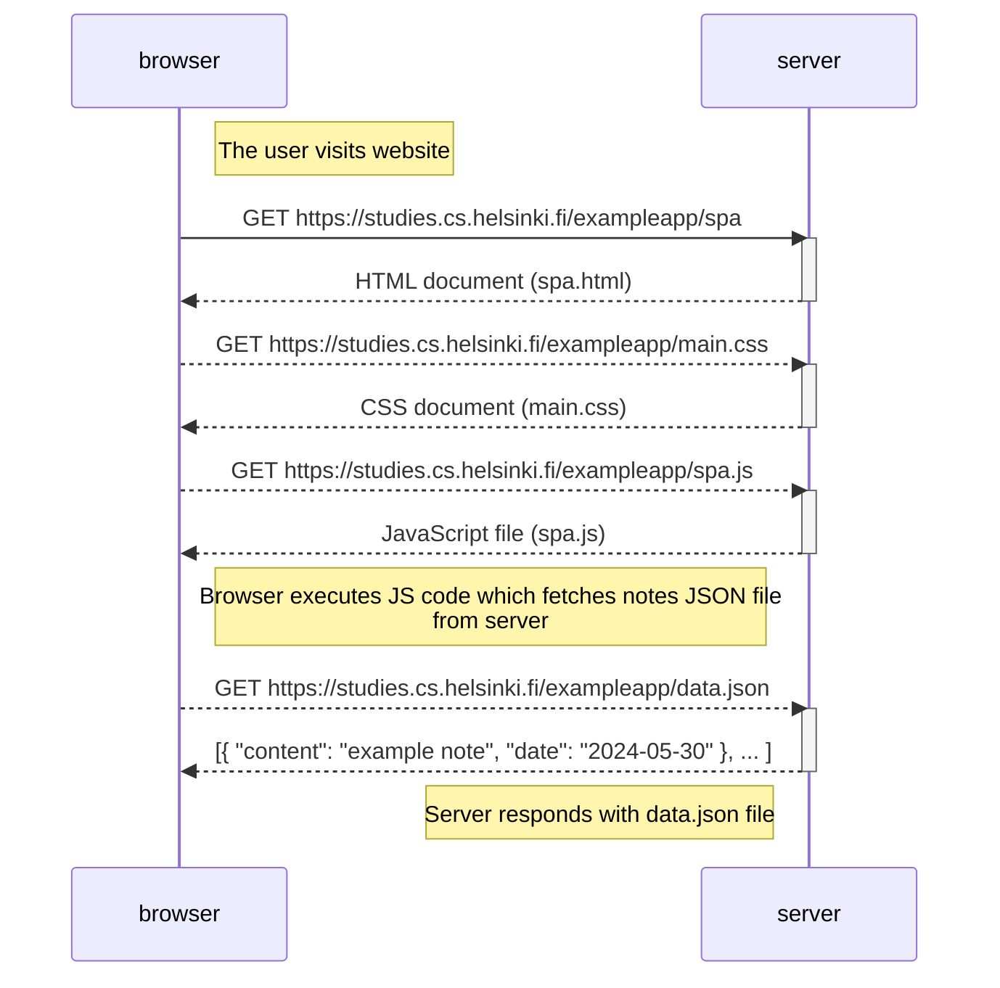

```mermaid
sequenceDiagram
      participant browser
      participant server
  
      Note right of browser: The user visits website
  
      browser->>server: GET https://studies.cs.helsinki.fi/exampleapp/spa
      activate server
  
      server-->>browser: HTML document (spa.html)
      deactivate server
  
      browser-->>server: GET https://studies.cs.helsinki.fi/exampleapp/main.css
  
      activate server
      server-->>browser: CSS document (main.css)
      deactivate server
  
      browser-->>server: GET https://studies.cs.helsinki.fi/exampleapp/spa.js
      activate server
      server-->>browser: JavaScript file (spa.js)
      deactivate server
  
      Note right of browser: Browser executes JS code which fetches notes JSON file <br/> from server 
  
      browser-->>server: GET https://studies.cs.helsinki.fi/exampleapp/data.json
      activate server
      server-->>browser: [{ "content": "example note", "date": "2024-05-30" }, ... ]
      deactivate server
      Note left of server: Server responds with data.json file
```
